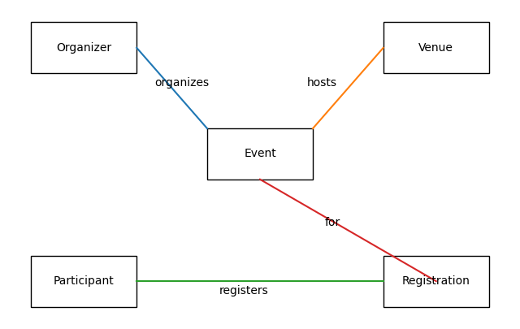

# 🎉 Event Management System

A SQL-based Event Management System developed as a Database Systems course project using relational database concepts.

# 📖 Project Overview

The Event Management System is a database project developed using SQL. It helps manage events, organizers, venues, participants, and registrations efficiently. This project demonstrates the use of relational database concepts and SQL queries.

# ✨ Features

- Manage event information
- Store organizer details
- Manage venue information
- Register participants
- Maintain registration records
- Retrieve data using SQL queries

# 🛠️ Technologies Used

- SQL
- Relational Database
- Database Design

# 🗄️ Database Tables

- Event
- Organizer
- Venue
- Participant
- Registration

# 💻 SQL Concepts Used

- CREATE TABLE
- PRIMARY KEY
- FOREIGN KEY
- INSERT
- UPDATE
- DELETE
- SELECT
- JOIN

# 🖼️ ER Diagram

# 📸 Project Images

## Database Structure (Object Explorer)

This image shows the database structure and all tables created in SQL Server.

.png)

## Sample Query Output

The following query retrieves event details along with organizer and venue information using SQL JOIN.

# 📄 Project Report

The complete project report is included in this repository.

# 🚀 Future Improvements

- Online Event Registration
- Admin Dashboard
- QR Code Attendance
- Email Notifications

# 👩‍💻 Developed By

**Ayesha Batool**

BS Computer Science

⭐ Thank you for visiting this repository.
